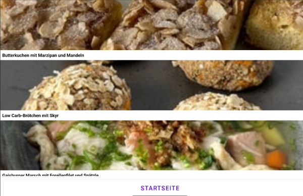

# Kaffee und Text

Android-App für Rezepte aus der SWR-Sendung ["Kaffee und Tee"](https://www.swr.de/video/sendungen-a-z/kaffee-oder-tee/rezepte/index.html)

## Entwicklung

Die App ist ein einfaches Android-Projekt, das mit [Android Studio](https://developer.android.com/studio) und [Cursor](https://www.cursor.com/) entwickelt wurde.

## Datenquellen

Die Daten werden direkt vom SWR bezogen.

